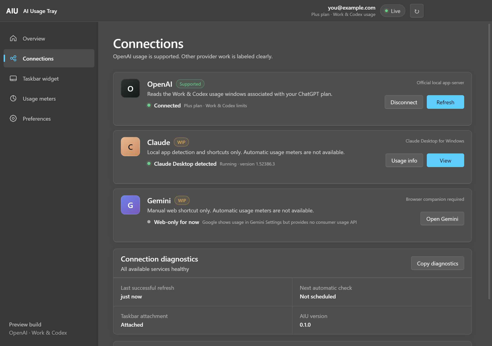
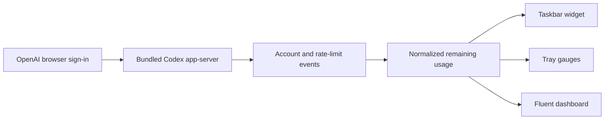

<div align="center">
  
  <h1>AI Usage Tray</h1>
  <p><strong>Your OpenAI Work &amp; Codex limits, living quietly in the Windows taskbar.</strong></p>
  <p>
    
    
    
    
  </p>
</div>

AI Usage Tray (AIU) turns usage windows that are normally buried in an account menu into a compact, glanceable Windows widget. It shows how much usage remains, when each window resets, and whether the latest reading is live or cached—without copying browser cookies or asking for an API key.


## Why AIU?

When you are deep in a coding session, finding out that a limit is nearly exhausted should not require opening another window. AIU keeps the important numbers beside the clock:

- **At a glance:** independent 5-hour and weekly remaining-usage meters.
- **Actually in the taskbar:** a native attached widget, not merely another overflow-tray icon.
- **Your layout:** rings, compact percentages, or progress bars; taskbar, tray, or both.
- **Calm by default:** unchanged values are not redrawn, so refreshes do not flash or flicker.
- **Clear under pressure:** optional red and breathing states at 5% remaining; a distinct `EMPTY` state at zero.
- **Windows-native feel:** Fluent spacing, Segoe UI Variable, system accent color, light/dark mode, high contrast, and reduced-motion support.

## Provider status

| Provider | Status | What works |
| --- | --- | --- |
| **OpenAI Work & Codex** | ✅ Supported | Sign-in, 5-hour and weekly windows, reset times, live refresh, saved-data fallback, taskbar/tray meters |
| **Claude** | 🚧 WIP | Claude Desktop/Code detection and safe shortcuts only; no automatic usage meter |
| **Gemini** | 🚧 WIP | Manual Gemini web shortcut only; no automatic usage meter |



AIU currently reads the metered Codex buckets associated with the signed-in ChatGPT account. It does **not** show ordinary ChatGPT conversation-message limits or OpenAI API billing credits.

## Install

Download one of the Windows builds from [Releases](/releases/latest):

- **Installer:** `AI-Usage-Tray-0.1.0-x64.exe`
- **Portable:** `AI-Usage-Tray-0.1.0-portable.exe`

The first-run guide lets you choose placement, visible meters, and account connection. The official `@openai/codex` runtime is bundled, so users do not need to install the Codex CLI separately.

> [!NOTE]
> The first community build is unsigned. Windows SmartScreen may show an “unrecognized app” warning. Verify the SHA-256 checksums included with the release before running it.

## What the widget can look like

### Placement

- **Taskbar:** attached beside a safe Windows taskbar region.
- **Tray:** one icon per enabled meter.
- **Both:** persistent taskbar information with quick tray access.
- **Start, center, or end:** with a fine offset control for coexistence with other taskbar tools.

### Display styles

- Circular remaining-usage gauges
- Compact labeled percentages
- Filled progress bars
- Independent meter colors
- Adjustable widget and text size
- Transparent, glass, or solid surfaces
- Optional `5H` and `7D` labels

Click a meter for the compact flyout. Right-click the tray icon for settings, refresh, and quit controls.

## How it works



AIU communicates with the bundled local Codex app-server. It uses the documented account and rate-limit methods, listens for account/rate-limit updates, and converts `usedPercent` into remaining usage. Refresh failures retain the last successful values and retry with bounded backoff.

## Privacy and security

- Authentication happens through OpenAI’s browser-based flow.
- Credentials remain in the Codex credential store.
- AIU stores display preferences—not copied cookies or passwords.
- Diagnostics deliberately omit account email, tokens, raw service errors, and executable paths.
- Claude detection reads installation/running metadata only and never reads Claude session files.
- Gemini is never scraped in the background.

## Troubleshooting

### The app appears to close immediately

AIU keeps running after its settings window closes. Look for the **AIU** icon in the notification area, then right-click it and choose **Settings**. Only the tray menu’s **Quit** action exits the process.

### The taskbar widget falls back to the tray

Open **Connections → Connection diagnostics** and check Taskbar attachment. Restarting Windows Explorer or changing display scaling can temporarily move the widget; AIU automatically attempts to reattach safely.

### Usage says “Saved data”

The latest refresh failed, but AIU kept the last valid values visible. It retries automatically using a bounded delay and refreshes again after Windows resumes from sleep.

### Claude or Gemini has no percentage

Those providers are explicitly **WIP**. Detection and shortcuts do not imply that a supported usage-data connection exists.

## Development

Requirements: Windows 10/11 and Node.js 22 or newer.

```powershell
git clone <repository-url>
cd ai-usage-tray
npm install
npm start
```

Run the test suite:

```powershell
npm test
```

Build the unpacked app, or create both Windows releases:

```powershell
npm run pack
npm run dist
```

Generated artifacts are written to `release/` and intentionally excluded from Git.

## Project structure

```text
src/
  main.js             Electron lifecycle, windows, taskbar, tray, refresh
  codex-client.js     Codex app-server JSON-RPC client
  usage.js            Rate-limit normalization
  settings-store.js   Validated local preferences
  providers.js        Provider capability and detection model
renderer/
  settings.*          Fluent dashboard and first-run setup
  taskbar.*           Attached taskbar widget
  details.*           Compact usage flyout
scripts/
  attach-taskbar.ps1  Windows taskbar attachment helper
tests/                Node test suite
```

## Roadmap

- [x] OpenAI Work & Codex usage meters
- [x] Native Windows taskbar attachment and tray fallback
- [x] Fluent settings dashboard and first-run setup
- [x] Flicker-resistant refresh, retry, and diagnostics
- [ ] Stable Claude usage integration if Anthropic exposes a supported consumer interface
- [ ] Stable Gemini usage integration if Google exposes a supported consumer interface
- [ ] Signed Windows releases and automatic updates

## Disclaimer

AI Usage Tray is an independent open-source project. It is not affiliated with or endorsed by OpenAI, Anthropic, Google, or Microsoft. Product names and trademarks belong to their respective owners.

## License

[MIT](LICENSE). Bundled third-party components retain their own licenses; Codex is distributed under Apache-2.0.
