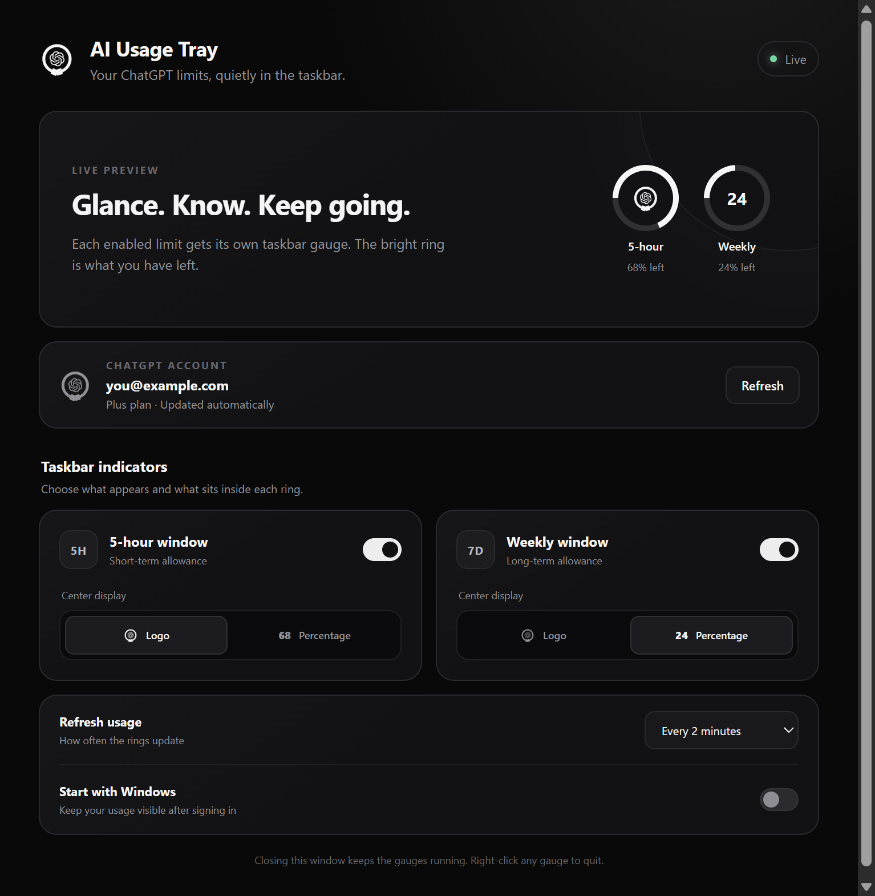

# AI Usage Tray

A minimalist Windows taskbar app that shows how much of your OpenAI Work & Codex usage remains. The project is currently in its design and development stage; release executables will be produced after the interface is approved.



## What it does

- Shows independent taskbar gauges for the **5-hour** and **weekly** usage windows.
- Can live directly inside the Windows taskbar, in the system tray, or in both places.
- Supports start, center, and end taskbar placement with a fine-position slider.
- Includes circular, compact-number, and filled progress-bar layouts with adjustable widget and text sizing.
- Uses independent colors for the 5-hour and weekly meters so they stay legible on different taskbar themes.
- Can warn at 5% remaining with a red state and optional low-motion breathing effect; zero usage gets a distinct empty state.
- Keeps an optional app/control icon in the notification tray even while the native taskbar widget is selected.
- Avoids unnecessary redraws during refreshes and safely repositions after Explorer or display changes.
- Lets you enable either gauge, both, or neither.
- Lets you put the OpenAI knot or the remaining percentage in the center of each ring.
- Drains the ring clockwise as usage is consumed.
- Opens a compact usage popup when you click a gauge.
- Supports optional launch at Windows sign-in and configurable refresh intervals.
- Uses OpenAI's browser-based sign-in. No API key or copied browser cookie is required.
- Includes a Connections dashboard with live OpenAI state, local Claude Code detection, and a safe route to Gemini's visible usage controls.
- Guides first-time users through placement, meter selection, and OpenAI connection, with an option to rerun setup later.
- Supports confirmed OpenAI disconnect and reconnect through the official local app-server.
- Keeps the last successful values visible during a failed refresh, retries with bounded backoff, and refreshes after system resume.
- Shows reset countdowns and a compact diagnostics panel without redrawing unchanged taskbar widgets.

The current OpenAI integration reports the shared Work & Codex usage windows associated with the signed-in ChatGPT plan. It does **not** report API billing credits or the message limits for regular ChatGPT conversations.

The product name stays provider-neutral because Claude and Gemini support is being developed. Claude Code detection and the Gemini usage-page route are available in the Connections dashboard, while actual usage meters remain marked experimental until each provider offers a stable, safe data path. AI Usage Tray will not copy browser cookies or silently scrape private endpoints.

## Development

Requires Node.js 22 or newer on Windows 10/11.

```powershell
npm install
npm start
```

Run the tests:

```powershell
npm test
```

When the design is finalized, `npm run dist` will produce the installer and portable Windows release.

The official `@openai/codex` package is bundled so end users do not need to install the Codex CLI separately.

## Privacy

Authentication and usage requests are handled by the local Codex app-server. Credentials remain in Codex's local credential store. AI Usage Tray stores only display preferences in its Electron user-data folder.

## License

MIT. Bundled third-party components retain their respective licenses; Codex is distributed under Apache-2.0.
